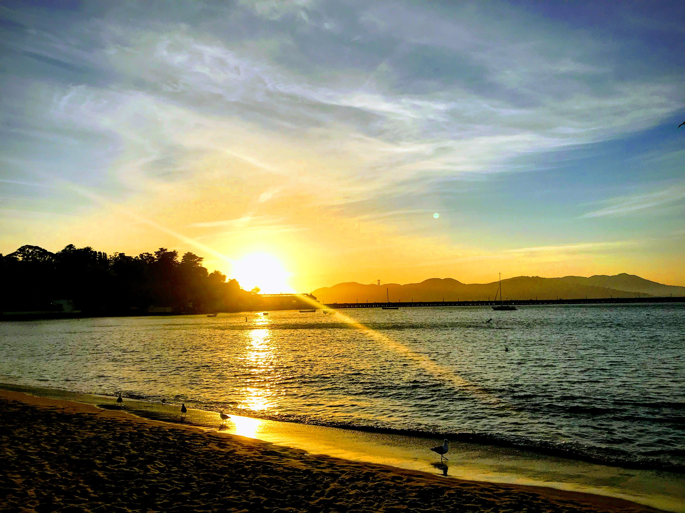

I'm Paulo, I am an Assistant Professor at Southeastern Louisiana University. I teach mostly programming and networking courses in the Computer Science department, you can check the full list on the teaching page. I also do some research on drones and IoT networks, all publications are in the, well, publications page.

This is my personal website, so the things I post might not be strictly about work. Just the interesting stuff I come across IRL and the interwebs!

For now, here's a photo I really like that I took in the bay area:

