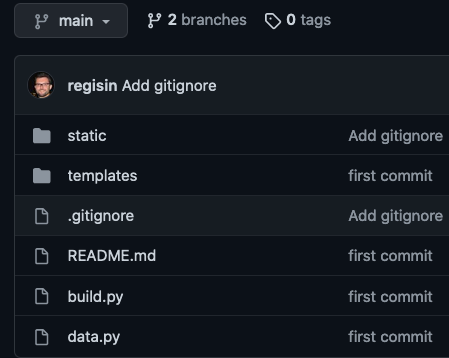

## Table of Content

- [Building and hosting a static website for free on GitHub](#building-and-hosting-a-static-website-for-free-on-github)
- [Recap](#recap)
- [Set up the GitHub.com account](#set-up-the-githubcom-account)
  - [Create the account](#create-the-account)
  - [Create the website repository](#create-the-website-repository)
  - [Uploading the new repository](#uploading-the-new-repository)
  - [Cleaning up the repo with `.gitignore`](#cleaning-up-the-repo-with-gitignore)
- [A little more about branches and GitHub Pages](#a-little-more-about-branches-and-github-pages)
  - [Deploying by hand](#deploying-by-hand)
  - [Deploy automatically with GitHub Actions](#deploy-automatically-with-github-actions)
- [Summary](#summary)

## Recap

We've been working on creating a static website using `python` with `Jinja2`. At this point we have a simple website with a couple of pages. The main take away so far is the workflow. Sure, you learned and saw an example of how to use the Jinja templates, and how to serve the website **locally** so you can check it out using your browser. But the workflow for creating new pages, new sub pages, that's not going to change. If you want to create 1, 2, 3, 10 new sub-pages on your site, you already have a step-by-step flow of how to do for one, all you need is to repeat the procedure (the order might be different for you, but essentially this is what we've been doing):

1. Create a new template for the page in the `/templates` folder
2. Add the data to the `data.py`
3. Load template and data brom the `build.py` script, combine them and output to the `/_site` build folder
4. Serve the `/_site` folder and open `localhost:8000` in the browser to check it out

So there's not much more about that. You might be able to master the Jinja template engine, make your static website prettier by changing the files that you already have, experiment with different fonts and CSS styles... What is missing, though, is having the website available on the Internet for anyone in the world to see!

In this post, I will show one way that you can host a website for free. And I'll use `GitHub.com` for that. So we are not going to be writing much code in this video, but we'll set up a GitHub account to build and host the website. It will be a somewhat long post.

## Set up the GitHub.com account

### Create the account

If you haven't yet, head over to [GitHub](https://github.com) and create an account. It's free, and if you are a student you can have a bunch of goodies like free Pro services.

After creating the account, you will have a dedicated link: `https://github.com/<your username>`. This page will list all of the GitHub *repositories* that you work with. Repositories (repos for short) are essentially all the different coding projects that you have. GitHub is a place where you can store your projects online. I won't get into much details about `git` and `GitHub`, in a nutshell GitHub is a website that you can store your `git` projects, and `git` is a tool that helps developer to keep track of changes in source-code. `git` is used locally, in your machine, and GitHub is the website that you can save these projects to. So if you loose your computer, for example, your projects will still be available online.

### Create the website repository

GitHub has this very cool feature that let's you host webpages for free, and we will use it here. In your account, go ahead and create a new repo:


The name of the repository is very important in this particular case. We need to name the repository as `<your username>.github.io`. Normally you can choose whatever name you'd like, but to be able to have our own website we need to follow that pattern. This repository will be the link to our website when we finish: `https://<your username>.github.io`.


### Uploading the new repository

After creating the repo, it will be empty by default, and we need to upload our files to it. There are different ways to do it as you can see:


I'll be using the first option with a little teak. First, I need to install `git` on my computer. I won't explain how to do that because it can vary from different operating systems. You can google `how to install git` and I'm sure plenty of results will show up. At the end of it, we need to be able to use the `git` command from our bash terminal. So let's open up the terminal and `cd` into the project folder:

```bash
cd /path/to/project/
echo "# My static website" >> README.md
git init
git add .
git commit -m "first commit"
git branch -M main
git remote add origin https://github.com/<your username>/<your username>.github.io
```

The `echo` command will just create a text file named `README.md` and write `# My static website` on it, GitHub recommends every repository to have a read-me file so that's what I did. Then we just follow the instructions, the only difference is that I use `git add .` instead of `git add README.md`, and that's because our project already has several files that we created, and not just the "read me", so we add all files to the repo that way. The rest of the commands will commit the code to the local repo (which is kind of a checkpoint, saving your progress). Then it will name a `branch` *main* (a branch is kind of a version of your project and `main` being, well, the most important one) branches are hard to explain, you might be better off by googling about it if you want. We then map the local repo just created to the remote one, the one we created using GitHub. Lastly, we `push` the code from the commit to the remote repo!

After the `git push` runs successfully, you can go to the GitHub page (`https://github.com/<your username>/<your username>.github.io`) and refresh it and you should now see all your project files there:


### Cleaning up the repo with `.gitignore`

If you notice there's a bunch of "junk" files in the repository:

1. A `__pycache__` folder that python creates when it builds the website
1. The `DS_Store` which is from my mac laptop that creates it automatically
1. And there's the `_site` folder, which is important, but as we see later, won't belong here

Luckily, it's an easy fix. In the project folder, create a file named `.gitignore` and add the following lines:

```txt
__pycache__/
.DS_Store
*.pyc
*.pyo
```

For learning purposes, I will include `_site/` later to this list. This file is special because it tells `git` to, well, *ignore* files and folders listed in it. Now we can upload this to GitHub and the repo will now ignore those files:

```bash
cd /path/to/project/
git rm -rf --cached .
git add .
git commit -m "Added gitignore"
git push -u origin main
```

Because originally I didn't exclude the files and actually committed and pushed them to the repo (I didn't have `.gitignore` yet), I have to first remove all the files from the repo. Then I add all the files again with `git add .`, this time respecting the `.gitignore` rules, and finally create a new commit and push to GitHub. Now the repository does not list those junk files anymore.



*Note: "committing" and "pushing" is something you will do quite often for even a single project, don't be afraid of committing frequently to the same repository.*

## A little more about branches and GitHub Pages

I know I know, I said you're better off googling what branches are than learning from me. Still true! Branches are a big topic, and if you end up using `git` and GitHub professionally, working on teams, you will learn that it can be used in different ways. For our use case we can thing of branches being completely different repositories (or sub-repositories if you will): one for source code (development), one for built code (production).

We already have one branch in our repository, the `main` branch. That's where all the source code will be. The template files, the build script, the data file... these are all part of the source-code of the website. The production branch will be named something different, and will contain only the production files, the ready-to-serve `html` files.. all the files in the `/_site` build folder will be in that (unnamed) branch.

The production branch will be named `gh-pages`, which is short for *GitHub Pages*. GitHub Pages is, well, a github thing. Each repository that you create you can create a GitHub Page for it. The way it works is quite simple: you configure your repository to enable GitHub Pages, then you select which branch of the repo will have the files for the pages.

The `<your username>.github.io` repo is special, that's the place you can showoff all of your projects, all of your repos. Each repo can also have its own pages set up, which will make `<your username>.github.io/<your awesome repo>` page be available! We won't go that far in this post, though. We will only work with the `<username>.github.io` repository.

We still have to create this second branch though, the `gh-pages` branch. It's quite simple: head to the repository website on your browser `https://github.com/<your username>/<your username>.github.io/`, then click on the branches drop-down button and create the branch right there:


Now we can go to the repository settings, and tell that the website should be pointing to the `gh-pages` branch and not `main`. Settings > Pages:


After saving it, the `https://<username>github.io` website will be serving the files from the `gh-pages`. Right now, nothing changed because when we created the new branch we just copied all of the files from the `main` branch, which is the default behavior. What we need to do now is build the website and only upload to the `gh-pages` branch the files inside the `/_site` folder.

### Deploying by hand

*Note: this section will have some more `git` commands that at the end of the post will be irrelevant. This is deploying the hard way. If you just want you can skip to the cool and easy stuff in the next section.*

So, we need to figure out how to replace the contents of the `gh-pages` branch with whatever is generated by the build script in the `/_site` sub-folder. First, let's think about the workflow we need to do by hand here. For any new version of the website that needs to go to production:

1. Run the build script: `python build.py`
1. Push the contents from `/_site` to the `gh-pages` branch

Sounds easy, right? We can do this with these commands:

```bash
cd /path/to/project/
python build.py
git add .
git commit -M "New build"
git subtree push --prefix _site origin gh-pages
```

Well, that's neat if you ask me. But there's a small issue, we needed to keep two copies of the built website, one in the `main` branch and another in the `gh-pages`. Another issue is that it can be quite annoying to do this each and every time you want to deploy your website, and sometimes you may make some mistakes on the way.. I know I have!

### Deploy automatically with GitHub Actions

We can make the deployment process automatic. To do so we can use any Continuous Deployment/Continuous Integration service out there. Originally I used to use TravisCI, but eventually it became a paid service. There are other solutions out there: CircleCI, Heroku, etc. However, the easiest one to deal with for this project by far is GitHub Actions.

GitHub Actions is yet another sweet sweet feature that GitHub gives us for free. And since everything we are doing is already on GitHub, using Actions won't require much effort.

So, what is GitHub Actions you may ask. In a nutshell, it is an actions that is triggered every time certain events happen with the repository. In our case we will trigger an action every time a new `push` event happens in the `main` branch of the repository. So... every time we push an updated version of the website to the `main` branch, the GitHub Action (that we will configure next) will be executed. This action will do the deployment steps that we did by hand: build, commit and push to the `gh-pages` branch.

So, to configure the Action, all we do is create and set up a file in our project. This file will be pushed to the `main` branch, and GitHub will run it on it's servers. Go ahead and create two folders in the project folder, name it `.github` and inside of it another folder, `workflows`. And create a file inside the `workflows` directory, name it anything you want as long as the extension is `.yaml`, I named mine `gh-pages.yaml`. It has to be `.yaml` which is just a file format. Make it look like this:

```yaml
name: Build and Deploy to GH Pages

on:
  push:
    branches:
      - main

jobs:
  build:
    runs-on: ubuntu-latest
    steps:
      - uses: actions/checkout@v2
      - name: Set up Python 3.9
        uses: actions/setup-python@v2
        with:
          python-version: '3.9'
      - name: Install dependencies
        run: |
          pip install jinja2
      - name: Build
        run: |
          python build.py
      - name: Deploy
        uses: peaceiris/actions-gh-pages@v3
        with:
            github_token: ${{ secrets.GITHUB_TOKEN }}
            publish_dir: ./_site
```

This `yaml` file describes the steps the Action will take to build and deploy the website. It's pretty intuitive to read, top to bottom. It's nothing different than what we did by hand earlier on our own machine:

1. Give this action a name
2. Configure the action to execute *on push to branch `main`*
3. Describe the step-by-step the *build* job will take (running on a ubuntu machine on GitHub servers)
   1. Install: `python 3.9`
   2. Install the dependency: `jinja2`
   3. Build website
   4. Deploy website to the `gh-pages` branch

For the last step, we use a handy third-party GitHub Action that pushes a sub-folder to a different branch. You can learn more in [their website](https://github.com/peaceiris/actions-gh-pages), you can even push it to a completely different repository.

Now we can add the `_site/` to the `.gitignore` file, because this folder will be created by the GitHub Action, not by us anymore. And finally, commit and push these new changes to the `main` branch:

```bash
git rm -rf --cached . 
git add .
git commit -m "Added build action"
git push -u origin main
```

After you `push`, you can even go to the repo's `Action` menu and see for yourself the progress of the build:


If successful, you can now visit the website at `https://<username>.github.io` and it should work just fine..

One last thing though! In my case, I have been using static assets (if you remember from previous posts), and at some point I configured in the `build.py` script the `BASE_URL='http://localhost:8000'` constant. If I visit `https://regisin.github.io/research` it doesn't load the images... because they are pointing to `localhost` which is not really what I want.


Since now the website is being hosted remotely on GitHub, I need to change it to: `BASE_URL='https://regisin.github.io'`. One last push...

```bash
git add .
git commit -m "Added build action"
git push -u origin main
```


And we're done! Phew, not a lot of coding, more configuration than anything else...

## Summary

In this post we:

- Created a GitHub account
- Created a special repository
- Created 2 different branches in the repository
- Pushed the source code of the website to the `main` branch
- Pushed the built website to the `gh-pages` branch that GitHub will serve from by hand
- Configured a CD process with GitHub Actions to automate the build/deploy process

