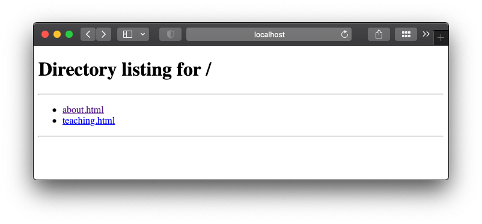
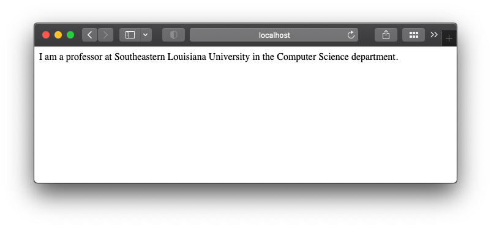
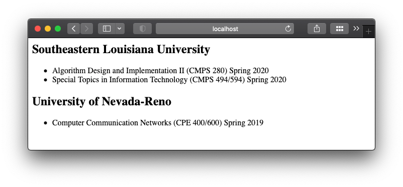

## Table of content

- [Table of content](#table-of-content)
- [Recap](#recap)
- [Jinja2 templates](#jinja2-templates)
- [Template inheritance](#template-inheritance)
- [Summary](#summary)

## Recap

So far, we have a simple build script that takes in a template filename, and spits out the exact file into a different folder, not that useful I must confess.

In this post, we will go one step further in our static website development. We will create 2 new pages, the `About`, and the `Teaching` pages. I'm a professor, so it makes sense for me to create a page that lists all the courses I have taught in my career so far. And the about page, well, is the about page, you can put anything about yourself in there.

## Jinja2 templates

Before we get started, we need to learn a little bit about how `Jinja2` works. If you've been following along, you'll remember that we created one single template, the `hello.html`, and we used `jinja` to create the `index.html` by injecting a variable into the template. That is the main idea of a templating engine, you create a template with some placeholders, and then when you build the pages you pass the actual values that will be printed out where the placeholders are.

Well, that's nice, but what you'll notice is that when you create new templates for pages in your website, you'll have a bunch of repetitive boilerplate `html` code scattered throughout your files.

Let's have a quick example. Create a new `html` file and name it `about.html`. Then create the html template as you want. This is mine:

```html
<html>
    <head>
        <title>About</title>
    </head>
    <body>
        <h1>About</h1>
        <p>I am a professor at Southeastern Louisiana University in the Computer Science department.</p>
    </body>
</html>
```

There are currently no variables in the template. That's because I personally like to visualize the page before I start passing variables to it.

Now I will create another template, the `teaching.html`. For me, a professor, it makes sense to list the courses I have taught, so that's what this template is for. It looks like this:

```html
<html>
    <head>
        <title>Teaching</title>
    </head>
    <body>
        <h1>Teaching<h1>
        <h2>Southeastern Louisiana University</h2>
        <ul>
            <li>Algorithm Design and Implementation II (CMPS 280) Spring 2020</li>
            <li>Special Topics in Information Technology (CMPS 494/594) Spring 2020</li>
        </ul>
        <h2>University of Nevada-Reno</h2>
        <ul>
            <li>Computer Communication Networks (CPE 400/600) Spring 2019</li>
        </ul>
    </body>
</html>
```

Now I need to modify my build script so I can output these 2 pages. First, I don't need the `hello.html` template anymore, that was just to show the hello world example. I'm just gonna go ahead and delete it. Now I can change the build script so instead of rendering the hello example, I render the about page and the teaching page:

```python
"""
About
"""
# /about.html
template = env.get_template('about.html')
output = template.render()
o = Path.cwd()
o = o / Path('_site/about.html')
with o.open(mode='w') as fh:
    fh.write(output)
"""
Teaching
"""
# /teaching.html
template = env.get_template('teaching.html')
output = template.render()
o = Path.cwd()
o = o / Path('_site/teaching.html')
with o.open(mode='w') as fh:
    fh.write(output)
```

Now when I run the build script, I will see `2` files in the `/_site` folder... Oops, I actually see 3, the `index.html` file, from the hello example is still there! I need to delete it, but I'll deal with it later. Let's checkout the newly rendered pages. Remember you can spin up using python with `python3 -m http.server --directory ./_site/` from the terminal inside your project folder.






Awesome, it's working! We will deal with the awkward index page in a different post.

Now back to the templates. If you notice there are some repetitive `html` tags that we had to put in both files, for example, the `<html>`, `<head>` and `<body>` tags. For these couple of pages that's absolutely alright, but imagine if your website has more pages. Maybe you'll have a blog page, then a projects page... the more pages you create, the more you will have to remember to edit if you want to change. For example, the title formatting, or the font of the entire website; you'd have to open each template, and make the exact same edit in each of them. **We can do better!**

Luckily, we can use Jinja's awesome engine to the rescue!

## Template inheritance

Jinja provides template inheritance, which is a fancy way of using a template inside of another template. We can use it to create a **base layout** file that centralizes all of the boilerplate code. If you want to learn more about Jinja, you can check their [website](https://jinja.palletsprojects.com). In this tutorial series, we only use a handful of its features.

Let's go ahead and create our base template file, call it `base.html` because we don't need to make things complicated for ourselves, right? The base template will look like this:

```html
<html>
    <head>
        <title>{{ title }}</title>
    </head>
    <body>
        
    </body>
</html>
```

Oh gosh there's a lot going on here! What is this monster? Let's break it down. We added `2` placeholders:

- The `{{ title }}`, that we can directly pass to the template as an attribute (more in a little bit)
- The content block `` that jinja will use in the inheritance scheme

We will never use the base template to render directly, but we will use it to design our other template pages. Let's go back to the `about.html` template. Now instead of all of those tags, we can edit to look like this:

```html


    <h1>{{ title }}</h1>
    <p>I am a professor at Southeastern Louisiana University in the Computer Science department.</p>

```

What jinja will do is it will render the about page by first reading the base template, because that's what the about is extending with ``. In object oriented programming terms, `about.html` is a subclass of the `base.html` template. And we are overriding the content block of the `base.html` with the about template one! Go ahead and run the build script: `python build.py`

The output will look exactly the same as before. However, as we scale up and create more subpages for the website, if we decide to change something like the CSS for the entire website, we can do it in one place, instead of changing it in every single template out there.

I did forget one thing, though...
Now that the `<title>` tag has a placeholder in it, I need to tel jinja what that title attribute should be. It's a simple fix in the build script, just change the `render()` call to pass the `title` attribute to it:

```python
template = env.get_template('about.html')
output = template.render(
  title="ABOUT ME"
)
```

Now, can I edit the `teaching.html` to extend the `base.html` template in a similar way? Go ahead and give it a try before continuing! Next, I'll show my new teaching template looks like after the changes:

```html


    <h1>{{ title }}<h1>
    <h2>Southeastern Louisiana University</h2>
    <ul>
        <li>Algorithm Design and Implementation II (CMPS 280) Spring 2020</li>
        <li>Special Topics in Information Technology (CMPS 494/594) Spring 2020</li>
    </ul>
    <h2>University of Nevada-Reno</h2>
    <ul>
        <li>Computer Communication Networks (CPE 400/600) Spring 2019</li>
    </ul>

```

Phew! That was a lot. But hopefully now you have a better understanding of how you can design your templates in a way that saves you from doing repetitive work in the future. We are one step further in our static website creation. We created `2` new pages using different jinja templates.

## Summary

In this post, we:

- Created 2 templates, each for a different subpage in the website
- Used the templates in the build script to create different static webpages
- Used Jinja2 template inheritance

