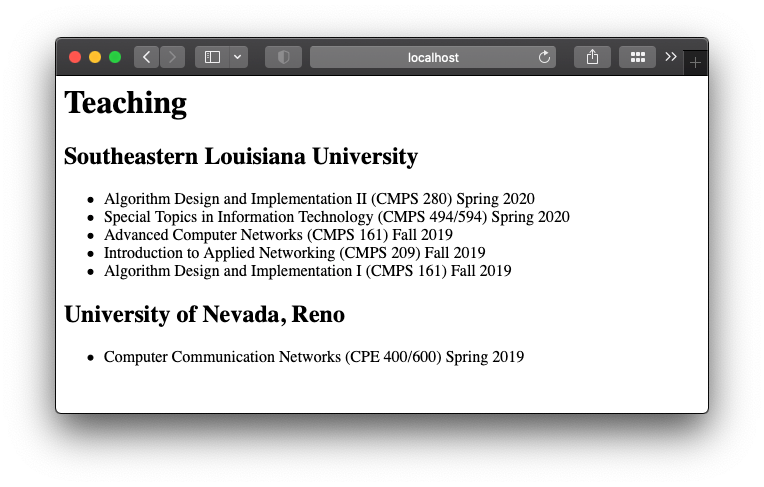

## Table of content

- [Table of content](#table-of-content)
- [Recap](#recap)
- [Storytime](#storytime)
- [Creating some data](#creating-some-data)
- [Reading the data](#reading-the-data)
  - [Template loops](#template-loops)
- [Summary](#summary)

## Recap

Previously, we have seen how to use Jinja2's template inheritance to build more consistent webpages. In this post, we will make our development process a little bit more productive (IMHO!) by separating the data from the other parts of the website.

If you have been following this tutorial series, you'll notice that the content of the webpages are either hardcoded into the templates themselves, or into the build script when passing values to the template. It's time to change that and give the data its own home.

## Storytime

A quick look back and some motivation is in place before we roll up our sleeves and get to work...

Let's look at what we have:

- a folder with a bunch of templates
- a python script that reads each template, changes a little bit, then spits out into the `/_site` folder, the build folder

If you notice, it doesn't really matter where our data comes from, right? Right now we have it coded into the build script (the `title` that we pass to the template). But we also have some information directly in the template files (the text in the `teaching.html` template):

- Source of `teaching.html`:

    ```html
    
    
        <h1>{{ title }}<h1>
        <h2>Southeastern Louisiana University</h2>
        <ul>
            <li>Algorithm Design and Implementation II (CMPS 280) Spring 2020</li>
            <li>Special Topics in Information Technology (CMPS 494/594) Spring 2020</li>
        </ul>
        <h2>University of Nevada-Reno</h2>
        <ul>
            <li>Computer Communication Networks (CPE 400/600) Spring 2019</li>
        </ul>
    
    ```

- Snippet from `build.py:

    ```python
    template = env.get_template('about.html')
    output = template.render(
        title="ABOUT ME" # Data `title` being passed to the template by the script
    )
    ```

If we are dealing with a couple of pages, sure, that can be manageable. But if there are several different pages, it can be quite annoying to have the information scattered throughout multiple different types of files.

But hey, we are using python and python can be modular. We can import python files from other python files!

Instead of having it all in the build script or template files, we can create python file that the only purpose is to store the data for our website. I want to say that again: it doesn't matter where your data comes from as long as we have access to it in our build script. You can have a database that you read from, you can crawl the web for the data.. If you can make the data into the build script somehow, you can pass it to the template to generate the final static pages.

For our intent and purpose, we will not be dealing with any database, any web crawler whatsoever. It's a simple static website after all, so we don't need a complex database server. We will use a separate python file where we will dump all of the information that will displayed in the website.

So without further ado, let's create a data file named `data.py` and put it in the same folder as the `build.py` script if you haven't already done it.

## Creating some data

So what does this data "store" look like? Data structures!

Most of the dynamic content that you see on the Internet are stored in tables. Well in python we don't have tables per se, but we have other things, like lists (`list`) and dictionaries (`dict`), and that's what we will be using to store the content. Which stuff should go on the datastore you ask? Well, let's take a look at what we have so far. In my case I'm going to look at the `teaching.html` template, which has the following in the ``:

```html
<h2>Southeastern Louisiana University</h2>
<ul>
    <li>Algorithm Design and Implementation II (CMPS 280) Spring 2020</li>
    <li>Special Topics in Information Technology (CMPS 494/594) Spring 2020</li>
</ul>
<h2>University of Nevada-Reno</h2>
<ul>
    <li>Computer Communication Networks (CPE 400/600) Spring 2019</li>
</ul>
```

If you notice, there's a pattern there, I have a list of courses, and that list is associated with the university where I taught it. And each course also has a list of semesters when I taught them.

There are a couple of directions I can take with this, but I'm going to keep it simple for now. However, in the future, changing the structure of the data can be easy, we just have to be savvy with how python works with it in the build script.

In my data file, I'll create a variable called `teaching`, this will be a list of dictionaries. Let's take a look at how it looks like:

```python
teaching = [
    {
            'name': 'Southeastern Louisiana University',
            'courses': [
                "Algorithm Design and Implementation II (CMPS 280) Spring 2020",
                "Special Topics in Information Technology (CMPS 494/594) Spring 2020",
                "Advanced Computer Networks (CMPS 161) Fall 2019",
                "Introduction to Applied Networking (CMPS 209) Fall 2019",
                "Algorithm Design and Implementation I (CMPS 161) Fall 2019",
            ]
    },
    {
        'name': 'University of Nevada, Reno',
        'courses': [
                    "Computer Communication Networks (CPE 400/600) Spring 2019",
    ]
    },
]
```

Each item in the teaching list will be a dictionary. And each dictionary will follow this pattern that I decided: each `dict` will have an key called `"name"` and the value will be the place where I taught the courses; each dictionary will then have yet another `list` of strings, in the key `"courses"`. Each string will be a course. And I will format this string the way that I want to see printed in the built page. This type of structured data looks a lot more like a `json` object, right? If you had this data in a sql database, you might have to deal with `JOIN` queries. I'm not saying that's not possible, but for my tiny personal website, this is more than enough.

## Reading the data

Now that I have some data, I need to use it. Let's go to the `build.py` script. At the top we need to load the data from the newly created `data.py` file. We can do that like this:

```python
from data import teaching
```

Notice that for any new data structure I add to the data store file, I can then import it by adding to that same `import` statement, just separate it with comma (`,`), like `from data import teaching, research_projects`.

Now in the `render()` call of the teaching page, I can pass the `teaching` list to the template:

```python
template = env.get_template('teaching.html')
output = template.render(
    title="Teaching",
    universities=teaching
)
```

Notice that the name of the list and the parameter used by the template do not have to match. In this case, the template will be looking for the parameter called `universities` and not `teaching`. Speaking of templates, we have some work to do over there too.

Move over to the `teaching.html` template. We have to modify our template so it reads the values being passed to it, instead of printing the hard-coded ones.

### Template loops

It's time to learn another feature of jinja, the loops. If you have some experience with python, you will find this very intuitive. It's like a way of having a for loop inside the template. It may seem odd that we mix python code with html code, but this thing works wonders with lists. The template doesn't know how many courses I taught, so a `loop` is the perfect way of dealing with this.

In the template, let's make it more generic and remove all the hard coded stuff. Then add the loop blocks like this:

```html


    <h1>{{ title }}<h1>

    
        <h2>{{ university.name }}</h2>
        <ul>
        
            <li>{{ course }}</li>
        
        </ul>
    


```

It is a generalized template that we created from the hard-coded one, right? Well, look at that, we can have nested loops in the template, and that works just fine. The syntax is very similar to the python syntax. The main difference is that we need the `` block to tell jinja which part of the `html` code will repeat and when to stop the repetition. We can access the inner fields using the dot-notation

Now all that's left to do is run the build script and checkout the generated webpages:

```bash
python built.py
python3 -m http.server --directory ./_site
```

Then navigate in your browser to `localhost:8000/teaching.html`, *Ta-Da*!



You can use the for loops just like you would in the python code. They are great for tabular data like this courses example.

## Summary

Here's a summary of what we did:

- Created data structures in a separate file `data.py`
- Populated the data structure lists with actual useful data
- Imported the data in the `build.py` script
- Injected the data into the template through the template engine
- Rendered pages by combining templates and data

