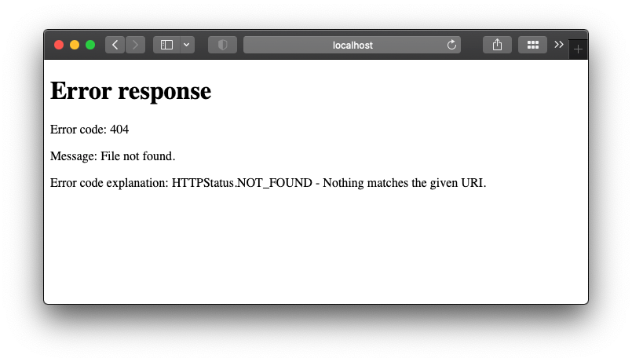

## Table of content

- [Table of content](#table-of-content)
- [Recap](#recap)
- [Making the base more than boilerplate](#making-the-base-more-than-boilerplate)
  - [Add menu to the header](#add-menu-to-the-header)
  - [All lefts reserved](#all-lefts-reserved)
  - [A word about the style](#a-word-about-the-style)
- [The face of the website](#the-face-of-the-website)
  - [Finally, the (disappointing) front page](#finally-the-disappointing-front-page)
- [Summary](#summary)

## Recap

I've been developing a static website that already has a few different pages in it:

- `/about`: an introduction to myself
- `/teaching`: list of all the courses taught
- `/research`: list of all research projects
- `/research/{title}`: subpage of `/research`, with more details of a single research project

Oh uh! There is one very important page missing, the `/`! This is the initial page that loads whenever you type in the address of a website on the browser. In our case, that would be `localhost:8000/`. I've been fiddling around with the subpages so much that I forgot the most important one. In this post I will create the initial index page for my website. It will be the place where all other subpages are referenced, so whoever visits the website can click around and visit them.

## Making the base more than boilerplate

So if you have ever visited websites (if you haven't, I'd like to know how you're reading this right now...) you might notice that they look subjectively pretty, with menus and organized buttons, and we have none of that. Because those menus are pretty much consistent throughout the website, it makes sense that we add it to the `base.html` template and not in every template we have already created!

If you've been following this series along, the current base template looks like this:

```html
<html>
    <head>
        <title>{{ title }}</title>
    </head>
    <body>
        
    </body>
</html>
```

Well, this template was useful to learn how templates actually work but now it just looks boring. I will add the header and footer sections:

```html
<html>
    <head>
        <title>{{ title }}</title>
    </head>
    <style>
        html,
        body {
            height: 100%;
            margin: 0;

            min-height: 100%;
            margin: auto;
            position: relative;
        }
        #header {
            padding: 10px;
        }
        #content {
            position: relative;
            padding-bottom: 2.5em; /* same as #footer.height*/
        }
        #footer {
            width: 100%;
            height: 2.5em;
            position: absolute;
            bottom: 0;
            left: 0;
            padding: 0;
        }
    </style>
    <body>
        <div id="header">
            
        </div>

        <div id="content">
            
        </div>

        <div id="footer">
            
        </div>
    </body>
</html>
```

There are a couple of new things here, let's break it down:

- We added a `<style>` tag to the `<head>`. This is where we define CSS styles that will be applied to the rendered components (the stuff in the `<body>`)
- We also added the `` block. This is a `Jinja2` thing. This block is a placeholder and will load the contents of the `'file.html'` in that exat spot

Having these Jinja building blocks can help keeping the templates organized and succint. As the templates grow bigger and become more complex, we can break them down into individual components, which is what is happening here. Naturally there is no `header.html` or `footer.html` file and we will need to create them now.

### Add menu to the header

The `header.html` block will contain a fragment of `html` code that will always be placed at the top of any page rendered by the build script. This is where I put the top menu links, so people can navigate through the website. Here's what my header block looks like:

```html
<a href="/">Home</a>
<a href="/about">About</a>
<a href="/teaching">Teaching</a>
<a href="/research">Research</a>
```

### All lefts reserved

I can't really say what goes in the footer of a website. Honestly, it's rare that I scroll all the way down of a website nowadays. Anyways, it could be links to social media accounts, it can show contact information... the footer of the website will always be at the bottom of a webpage, whatever you think deserves that space, you put it in the `footer.html`. Mine looks like this:

```html
<footer>
    <p>No rights reserved 2021</p>
</footer>
```

### A word about the style

If you noticed, I hard coded all the CSS style in the `base.html` template. For a small website like this it should be fine. However, if your website grows or you just want to use the best practices for the long term, add the stylesheet to your static assets in a css file. Create the `static/css/style.css` file, and move the stuff from the `<style>` tag in there:

```css
html,
body {
    height: 100%;
    margin: 0;

    min-height: 100%;
    margin: auto;
    position: relative;
}
#header {
    padding: 10px;
}
#content {
    position: relative;
    padding-bottom: 2.5em; /* same as #footer.height*/
}
#footer {
    width: 100%;
    height: 2.5em;
    position: absolute;
    bottom: 0;
    left: 0;
    padding: 0;
}
```

Now, in the `base.html`, remove the `<style>` tag, and add `<link rel="stylesheet" href="path/to/static/assets/css/style.css">` in the `<head>`:

```html
<!-- ommitted code here -->
    <head>
        <title>{{ title }}</title>
        <link rel="stylesheet" href="{{ BASE_URL }}/css/style.css">
    </head>
<!-- ommitted code here -->
```

We use the `BASE_URL` value to define the path of the static asset for the CSS stylesheet. That value is already being passed to the templates by the `build.py` script.

```python
BASE_URL='http://localhost:8000'

# ommitted code here

template = env.get_template('about.html')
output = template.render(
    BASE_URL=BASE_URL,
    title="About",
)
# ommitted code here 
```

Cool, we now have a nice little menu at the top and a useless footer at the bottom of every page... but I think I'm forgetting something... oh yeah, the initial page!

## The face of the website

If I visit my site at `http://localhost:8000` it looks weird, like it a file explorer, listing all the folders and files in the build dir `/_site`. That is the default behavior of the python webserver we use. If there is no `index.html` it will list the files of the folder. While that's ok while you are developing on your own computer, it is definitely not a good thing to have that hapopen when your website is actually hosted on an actual server.


In fact, that is usually NOT the default behavior of hosted webservers out there. To disable this on the python webserver is easy, we just add `-d False` to the command line:

```bash
python3 -m http.server --directory ./_site -d False
```

Now if I navigate to `localhost:8000` it returns the infamous `404 Not Found` page:



### Finally, the (disappointing) front page

Cool, but wnow I need to decide what the face of my website will be. In practice it could be many different things. Some personal websites are blogs, so their initial page is the list of blog posts. Others provide an intro to the website explaining what it is about. Well, I already have an `/about` page created, and since I'm feeling lazy right now, I will just reuse it, so the home (`localhost:8000/`) as well as the about (`localhost:8000/about`) will be the exact same thing.

In my build script I'll add this at the beginning:

```python
"""
Home
"""
# /
template = env.get_template('about.html')
output = template.render(
    BASE_URL=BASE_URL,
    title="Home",
)
o = BUILD_PATH / Path('index.html') # http://BASE_URL/
with o.open(mode='w') as fh:
    fh.write(output)
```

It is the same as the `/about`, just changing the output path to be the build folder itself `/_site/index.html`, and also passing a different `title` to make sure visitors don't get confused :shushing_face: :sunglasses:.

## Summary

In this post we:

- Created the header and footer blocks
- Put the CSS styles in a static asset
- Disabled the directory listing option of the python webserver
- Created the front page (reused the `/about` page)

